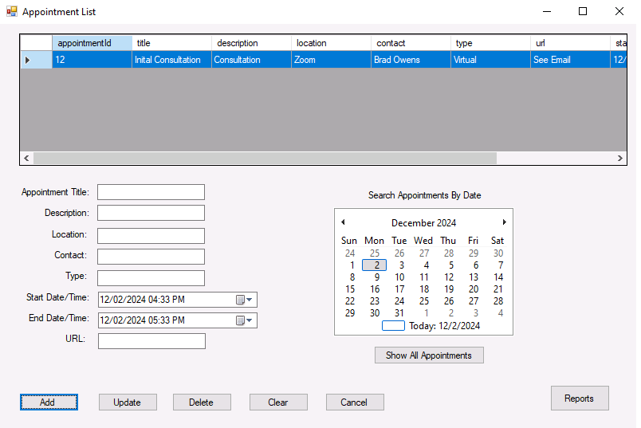

# Global Scheduler

A desktop scheduling application built using C# and MySQL, designed to manage customer appointments efficiently. This application features multilingual login, timezone-aware scheduling, calendar views, user alerts, and full CRUD functionality for customer and appointment management. It demonstrates expertise in scalable, user-centric application design and robust database integration.

## Features

- **Multilingual Login**: Supports multiple languages for login, with real-time error message translation.
- **Timezone-Aware Scheduling**: Automatically adjusts appointment times based on the user's timezone.
- **Calendar Views**: View and manage appointments in an intuitive calendar interface.
- **User Alerts**: Sends reminders for upcoming appointments, ensuring users are notified in advance.
- **Full CRUD Operations**: Create, Read, Update, and Delete customers and appointments with validation.
  
## Technologies Used

- **C#**: Main programming language for application logic and UI.
- **MySQL**: Database for storing customer and appointment data.
- **Windows Forms**: For building the desktop user interface.

## Screenshot

